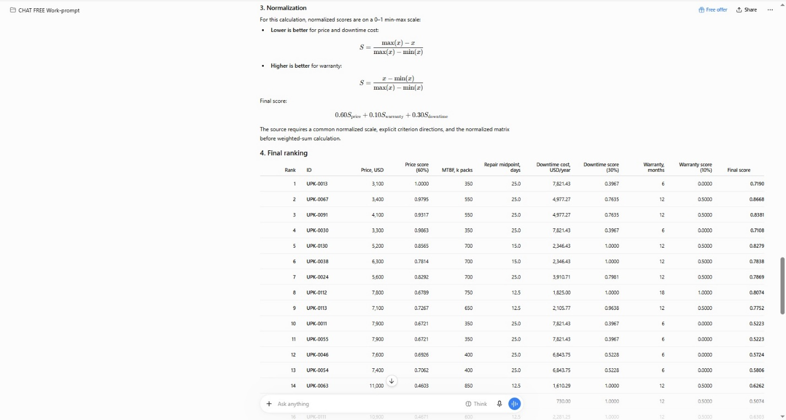
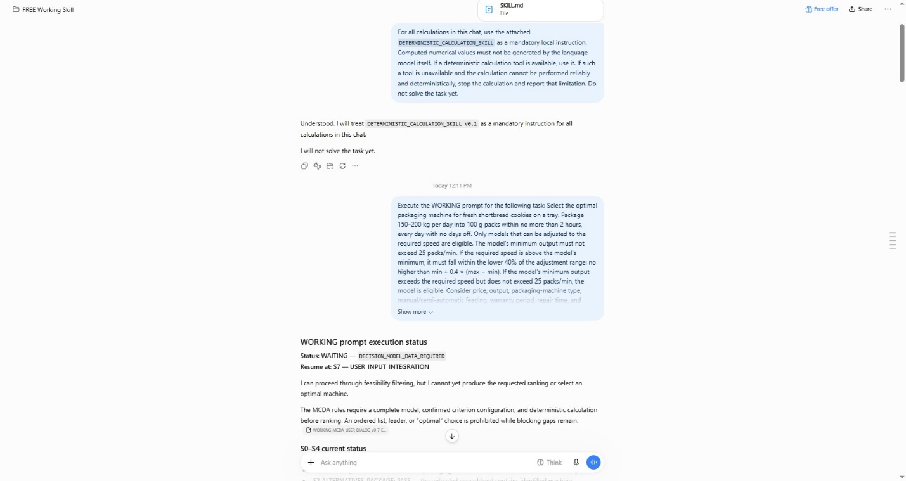
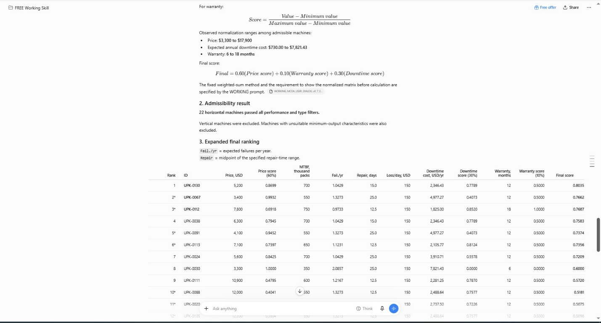

# Example: ChatGPT Free — incorrect calculation without the skill, correct final result with the skill

This example uses an MCDA task for selecting a packaging machine. The packaging problem itself is not the point. The point is what happened at the **calculation layer**.

## Run setup

- Environment: ChatGPT Free.
- The run with the calculation skill was performed in a separate project to reduce carry-over from earlier decision inputs.
- The machine spreadsheet and the WORKING prompt were available as project sources.
- `SKILL.md` was attached directly to the chat and activated as a mandatory local instruction for calculations.

## 1. Without the calculation skill: the formulas were stated correctly, but the arithmetic result was wrong

In the first ChatGPT Free run, the assistant used the intended min-max normalization formulas, but some numerical values were calculated incorrectly.



For a lower-is-better downtime criterion, the correct normalized score is:

```text
DowntimeScore = (max_downtime - value) / (max_downtime - min_downtime)
```

Using the values shown in the run:

```text
max_downtime = 7,821.43
min_downtime =   730.00
```

For `UPK-0067`:

```text
(7,821.43 - 4,977.27) / (7,821.43 - 730.00) = 0.4011
```

The response table showed `0.7635`.

For `UPK-0130`:

```text
(7,821.43 - 2,346.43) / (7,821.43 - 730.00) = 0.7721
```

The response table showed `1.0000`.

These incorrect intermediate values propagated into the displayed final scores and changed the ordering. For example, the first run showed `UPK-0067` with a final score of `0.8668`, while the correctly calculated weighted score is approximately `0.7662`.

## 2. Activating the calculation skill

The skill was attached as an ordinary `SKILL.md` file. No special agent framework or code environment was required for the user-facing workflow.

The chat was first given a short instruction to treat the attached skill as mandatory for all calculations and to avoid generating computed numerical values from the language model alone when a deterministic calculation mechanism was available.



The task was then executed normally.

## 3. With the skill: deterministic calculation and result validation

After the decision rules were confirmed and calculation was authorized, the assistant routed the numerical phase through a deterministic calculation mechanism, produced a trace, and validated the result.



The final result was:

```text
Winner: UPK-0130
Final weighted score: 0.8035
```

This final score is consistent with the independently checked arithmetic:

```text
Price score     = (17,900 - 5,200) / (17,900 - 3,300) = 0.8699
Warranty score  = (12 - 6) / (18 - 6)                 = 0.5000
Downtime score  = (7,821.43 - 2,346.43) / (7,821.43 - 730.00) = 0.7721

Final score = 0.60 * 0.8699 + 0.10 * 0.5000 + 0.30 * 0.7721
            = 0.8035
```

The same check gives approximately `0.7662` for `UPK-0067`, so `UPK-0130` remains ahead under the confirmed model.

### Important note about the visible trace

One displayed intermediate downtime-score value in the skill-assisted screenshot is not fully consistent with the normalization formula, even though the final weighted score and final ordering match the independently checked arithmetic. For that reason, this example should be read as evidence of improved **calculation discipline and final-result reliability**, not as a claim that every displayed intermediate number is always error-free.

## Conclusion

In this observed run, the skill did not change the MCDA decision rules. It changed the **execution discipline of the numerical stage**:

- use deterministic calculation when available;
- keep formulas and inputs explicit;
- show a calculation trace;
- validate the final result after calculation;
- stop rather than silently invent a numerical answer if reliable deterministic calculation is unavailable.

This is a single observed example, not proof that the same behavior will occur in every model, account, task, or run.
